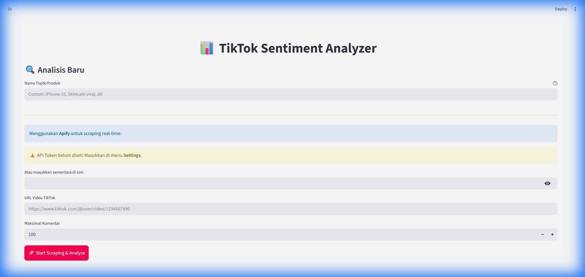

# 📊 TikTok Sentiment Analyzer

 
 


Aplikasi desktop lokal untuk **Analisis Sentimen Komentar TikTok** secara real-time. Aplikasi ini memudahkan Anda mengambil data komentar dari video TikTok, menganalisis sentimennya (Positif/Negatif/Netral), dan memvisualisasikan hasilnya dalam bentuk grafik menarik.

---

## 📸 Preview Aplikasi



*Dashboard interaktif dengan tema TikTok Red, chart distribusi sentimen, dan word cloud.*

---

## ✨ Fitur Utama

- **🕷️ Real-time Scraping**: Terintegrasi dengan **Apify** untuk mengambil ratusan komentar hanya dalam hitungan detik.
- **🧠 Analisis Sentimen Indonesia**: Menggunakan metode **Lexicon-based** yang dioptimalkan untuk Bahasa Indonesia, termasuk handling slang (e.g., "gacor", "zonk", "worth it").
- **📊 Visualisasi Data**:
  - **Pie Chart**: Persentase sentimen.
  - **Word Cloud**: Tren kata yang sering muncul.
  - **Histogram**: Distribusi skor sentimen.
- **💾 Database Lokal**: Semua hasil analisis tersimpan otomatis di **SQLite**, bisa diakses kembali kapan saja via menu *History*.
- **🖥️ UI Simpel & Elegan**: Antarmuka bersih tanpa konfigurasi rumit.

---

## 🛠️ Teknologi yang Digunakan

| Komponen | Teknologi | Deskripsi |
| --- | --- | --- |
| **Framework** | **Streamlit** | Frontend web interaktif berbasis Python |
| **Scraper** | **Apify Client** | Mengambil data komentar TikTok secara reliable |
| **Database** | **SQLite** | Penyimpanan data lokal ringan (tanpa server) |
| **Visualization** | **Matplotlib** | Membuat grafik statis dan statistik |
| **Processing** | **Pandas** | Manipulasi dan cleaning data |

---

## 🚀 Cara Instalasi

### Prasyarat
1. Pastikan terinstall **Python 3.10+**.
2. Memiliki akun **[Apify](https://apify.com/)** (Gratis) untuk mendapatkan API Token.

### Langkah-langkah
1. **Clone Repository**
   ```bash
   git clone https://github.com/delfika12/TikTok-Sentiment-Analyzer.git
   cd TikTok-Sentiment-Analyzer
   ```

2. **Install Dependencies**
   ```bash
   pip install -r requirements.txt
   ```

3. **Jalankan Aplikasi**
   ```bash
   streamlit run app.py
   ```

---

## 📖 Cara Penggunaan

1. **Setup Token Apify** (Hanya sekali):
   - Buka menu **⚙️ Settings** di sidebar kiri.
   - Masukkan **Apify API Token** Anda.
2. **Mulai Analisis**:
   - Buka menu **🔍 Analisis**.
   - Masukkan **Nama Topik** (misal: "Review iPhone 15").
   - Paste **Link Video TikTok**.
   - Klik **🚀 Start Scraping & Analyze**.
3. **Lihat Hasil**:
   - Tunggu proses selesai.
   - Dashboard akan menampilkan grafik sentimen dan tabel komentar.

---

## 📂 Struktur Project

```
TikTok-Sentiment-Analyzer/
├── app.py                # Main Application (Streamlit)
├── scraper.py            # Modul Integrasi Apify
├── sentiment.py          # Modul Analisis Sentimen (Lexicon)
├── database.py           # Operasi SQLite (CRUD)
├── visualization.py      # Modul Grafik & WordCloud
├── utils.py              # Text Preprocessing & Cleaning
├── assets/
│   ├── lexicon_id.json   # Kamus Kata Sentimen Indonesia
│   └── app_screenshot.png
├── data/
│   └── sentiment.db      # File Database (Auto-generated)
└── requirements.txt      # Daftar Library Python
```

---

## 📝 Catatan/Disclaimer
- Aplikasi ini membutuhkan koneksi internet untuk scraping via Apify.
- Pastikan Anda memiliki kredit Apify (Free tier cukup untuk penggunaan wajar).
- Lexicon sentimen dapat diedit/ditambahkan di `assets/lexicon_id.json`.

---

**Created with ❤️ by Delfika**
